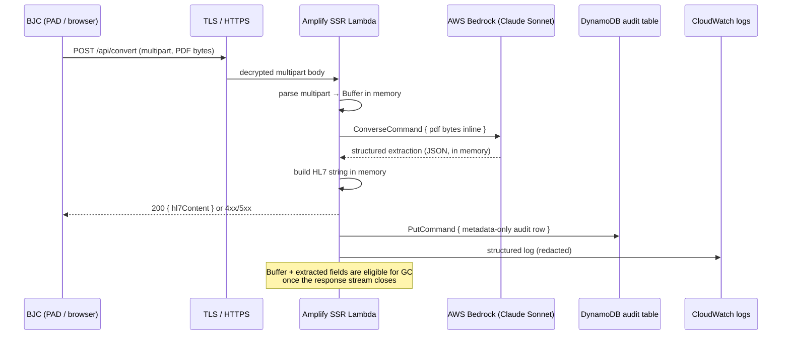

# PHI Data Flow — BJC PDF-to-HL7

## Summary

On the SMEC AI side, patient data exists **only in memory during a single
request**. Nothing PHI-shaped persists on failure. The only artefact left
behind by any request — success or failure — is a single DynamoDB audit row
that records **metadata only**: a hashed filename prefix, file size, duration,
document type, outcome, the authenticated user's email, patient initials in
`F.L.` form, classification confidence (integer), and a sanitised warning
list. There is no full name, no DOB, no Medicare number, no address. The
PDF buffer is garbage-collected within milliseconds of the request handler
returning; no file is written to Lambda's `/tmp`, no object is staged in
S3, and no upstream service is called with a PDF URL.

This document is the customer-facing proof of that claim, with line-level
evidence and a verification recipe.

---

## Request lifecycle



---

## PHI residency table

| Leg | Data present | Persistence | File:line evidence | Retention on failure |
|---|---|---|---|---|
| Inbound TLS (BJC → Amplify) | Encrypted multipart payload | Wire only, decrypted on Lambda receipt | Amplify SSR Lambda is HTTPS-only by default (Amplify CloudFront termination) | None — connection closed on error |
| Lambda multipart parse | PDF bytes as a Node `Buffer` | In-memory only; GC'd within ms of handler return | `lib/convert/form-data.ts:71` (`Buffer.from(await file.arrayBuffer())`) | None — Buffer goes out of scope and is GC eligible |
| Bedrock call (Lambda → Bedrock) | PDF bytes inline in the `Converse` request | Wire only (TLS); no S3 staging | `lib/vision-extractor.ts:81` (`source: { bytes: pdfBuffer }`) | None — request body is not retained by Bedrock |
| Bedrock response | Structured JSON (firstName, lastName, dob, medicareNo, etc.) | In-memory only | Returned to caller in `lib/vision-extractor.ts` | None — object goes out of scope |
| HL7 build | HL7 message as a string (contains PHI by design — it's the output the customer asked for) | In-memory only; returned in response body | `lib/hl7-builder.ts` | None — string goes out of scope |
| Audit row (DynamoDB) | **Metadata only**: month, ts, documentType, outcome, source, messageType, diagnosticServiceSection, **hashed** filename prefix, ext, size, duration, warningCount, sanitised warnings, userEmail, F.L. patient initials, mailboxHint, classificationConfidence (integer), letterSubtype | Persisted in `bjc-pdf-to-hl7-audit` | Hash: `lib/audit.ts:155-157`. Redaction filter: `lib/audit.ts:107-127`. Builder: `lib/audit/build-row.ts:48-59, 83-144`. F.L. initials only: `lib/audit.ts:84-98` | A `fail` row is written with the same metadata-only schema (no extracted fields) — see `buildFailureAuditRow` in `lib/audit/build-row.ts:152-166` |
| CloudWatch logs | Operational messages + Error name/message. Context objects pass through `redact()` recursively | Persisted in CloudWatch | `lib/server/logging.ts:198-211` (`logOperationalError`); `REDACT_KEYS_EXACT` set: `lib/server/logging.ts:19-53`; recursive `redact()`: `lib/server/logging.ts:82-106` | Error message and `name` are logged; PHI keys (medicare, dob, names, addresses, phones, providerNumber, suburb, postcode, state, etc.) are replaced with `"[redacted]"` |
| Lambda `/tmp` | **Unused** | None | No `fs.writeFile` / `fs.writeFileSync` / `createWriteStream` exists in any request-path file | N/A |

---

## What happens on failure

The buffer is dropped (out-of-scope after the handler returns) and is GC
eligible within milliseconds. No `success` audit row is written. A `fail`
audit row records the outcome with the same metadata-only schema — there are
no extracted patient fields, because extraction never completed. The error is
logged via `logOperationalError`, which extracts only `name` / `message` /
`code` from the `Error` and runs all context through the redactor. Stack
traces are gated behind `LOG_DEBUG=1` and not enabled in production. Within
milliseconds of the failure, the only artefact left on the SMEC AI side is
the metadata audit row.

---

## Verification

A reader can confirm this themselves:

1. **No file I/O in the request path** — grep the codebase:
   ```bash
   grep -rn "fs.writeFile\|createWriteStream\|fs.appendFile" lib/ app/api/
   ```
   Returns nothing under the convert pipeline.

2. **No S3 staging** — grep for any S3 client use during conversion:
   ```bash
   grep -rn "PutObjectCommand\|s3.upload\|@aws-sdk/client-s3" lib/ app/api/convert/
   ```
   Returns nothing.

3. **PDF is passed inline to Bedrock** — `lib/vision-extractor.ts:81` shows
   `source: { bytes: pdfBuffer }` — bytes go into the request body, not via
   an S3 URI.

4. **Audit row schema is metadata-only** — read `lib/audit.ts:16-77`
   (the `AuditRow` interface) and `lib/audit/build-row.ts:114-143`
   (the row builder). No raw `firstName` / `lastName` / `dob` / `medicareNo`
   fields are ever assigned.

5. **Warnings are filtered** — `lib/audit.ts:107-127` (`redactWarning`)
   drops any string with 8+ consecutive digits or a DOB-shaped date.

6. **CloudWatch context is redacted** — `lib/server/logging.ts:19-53`
   lists the redaction key set; `lib/server/logging.ts:55-93` shows the
   recursive redactor.

7. **Run the test suite** — the redaction guarantees are covered by:
   ```bash
   bun test lib/audit/build-row.test.ts lib/server/logging.test.ts
   ```
   In particular, look at the `describe("redactWarning + persistableWarnings
   — PHI compliance proof")` block in `build-row.test.ts` — it feeds the
   builder Medicare-shaped, DOB-shaped, and phone-shaped warnings and asserts
   they never appear in the persisted row.

8. **Reproduce an error** — force a Bedrock timeout (lower the timeout env)
   and inspect the CloudWatch log entry plus the corresponding `fail` row in
   DynamoDB. Confirm no PHI keys are present.

---

## Out-of-scope (intentionally)

This document covers the SMEC AI side of the pipeline. The customer-side
mailbox-to-PAD-to-SMEC-AI leg is owned by BJC and is documented separately
in `docs/research/pad-bearer-token-gotchas.md`. The browser-upload leg
(operator uploads a PDF via the web UI) is identical to the email leg from
the moment the multipart body arrives at the Lambda.
